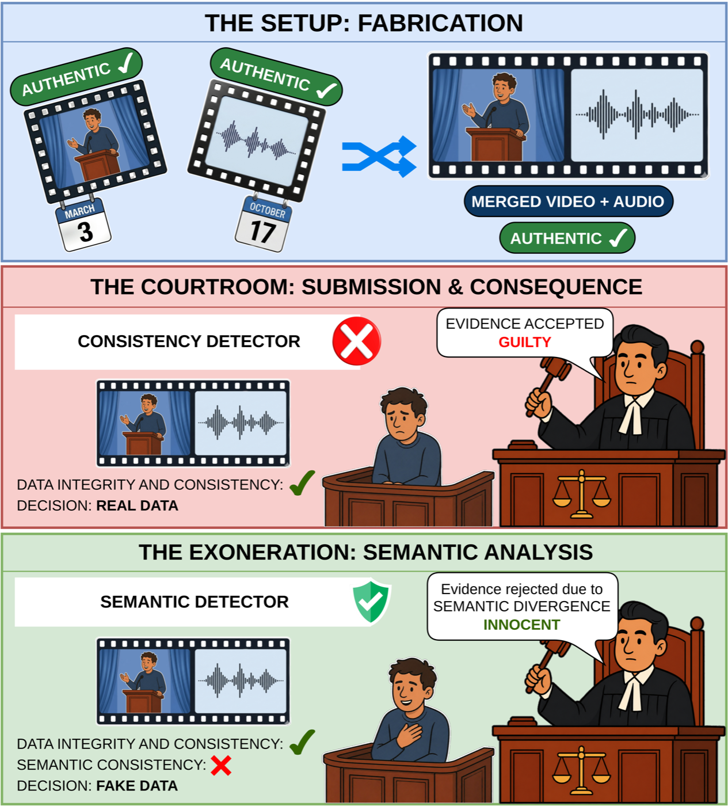
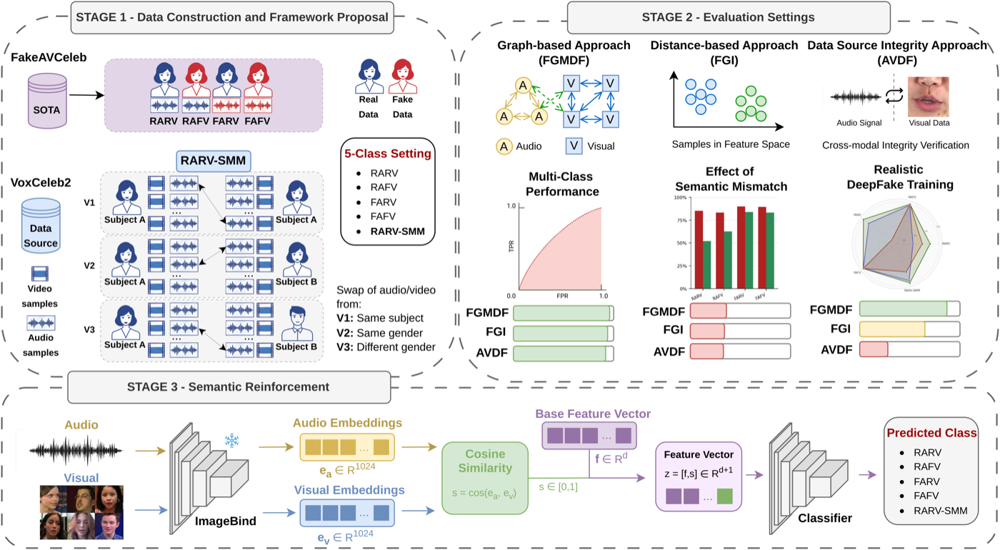
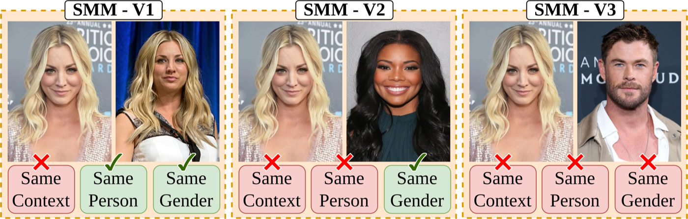
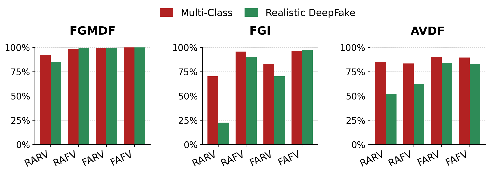
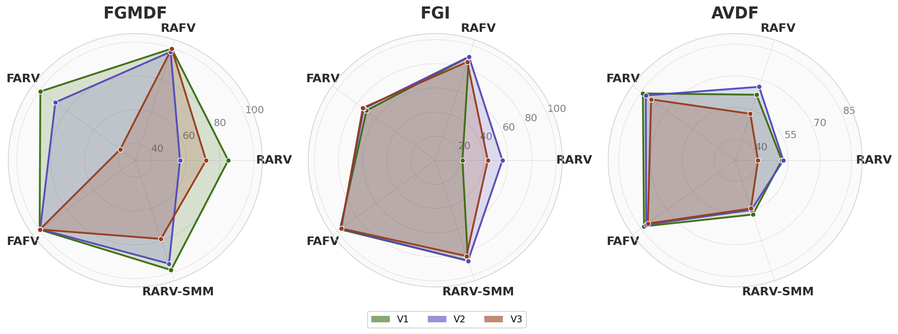

# RARV-SMM: Semantic Mismatch as a Novel DeepFake Challenge

*Official code for our paper:*

> Are DeepFakes Realistic Enough? Exploring Semantic Mismatch as a Novel Challenge
> Sharayu Nilesh Deshmukh, Kailash A. Hambarde, Joana C. Costa, Hugo Proença, and Tiago Roxo
> Instituto de Telecomunicações, Universidade da Beira Interior, Portugal

[Paper (arXiv)](https://arxiv.org/abs/2604.28022)

***

Current audio-visual DeepFake detectors assume that any **real audio + real video** pair is automatically authentic, and only look for synthesis artifacts or lip-sync errors. We show this assumption is wrong: genuine audio and genuine video from *different* contexts can be combined into highly misleading content that carries no signal-level manipulation at all, and existing state-of-the-art detectors accept it as real.


*A four-class detector inspects authentic video from one event and authentic audio from another, finds no synthesis artifacts in either stream, and accepts the fabricated composition as real. Only a semantic-aware detector can catch this.*

This repository contains only the **new** contributions of the paper — it does **not** vendor the baseline SOTA detectors (FGMDF, FGI, AVDF/MRDF), which are third-party repositories cited below and extended, not copied:

1. **RARV-SMM data construction pipeline** — building a fifth class (Real Audio-Real Video with Semantic Mismatch) from VoxCeleb2, in three variants of increasing audio-visual divergence.
2. **Semantic reinforcement strategy** — a frozen ImageBind audio-visual cosine similarity score, concatenated as an extra feature into the final classifier of three baseline architectures (FGMDF, FGI, AVDF).


*Stage 1 constructs RARV-SMM samples from VoxCeleb2 across three variants and integrates them with FakeAVCeleb to form a five-class dataset. Stage 2 evaluates three models with fundamentally different detection strategies. Stage 3 applies the model-agnostic semantic reinforcement strategy using frozen ImageBind embeddings.*

## The RARV-SMM variants


*V1: audio and video of the **same identity**, different context. V2: **different identities, same gender**. V3: **different identities, different gender** — maximizing audio-visual divergence.*

## Results

**Five-class accuracy/AUC across variants** (FakeAVCeleb, no semantic reinforcement):

| Model | V1 ACC | V1 AUC | V2 ACC | V2 AUC | V3 ACC | V3 AUC |
|:------|:------:|:------:|:------:|:------:|:------:|:------:|
| FGMDF | 98.80  | 99.88  | 96.73  | 99.26  | 93.58  | 99.51  |
| FGI   | 91.18  | 98.15  | 91.11  | 98.69  | 88.17  | 97.76  |
| AVDF  | 67.65  | 90.44  | 67.73  | 90.68  | 61.61  | 87.73  |

**Effect of semantic reinforcement** (ImageBind cosine score appended to the classifier):

| Model | V1 ACC | V1 AUC | V2 ACC | V2 AUC | V3 ACC | V3 AUC |
|:------|:------:|:------:|:------:|:------:|:------:|:------:|
| FGMDF | 98.30  | 99.77  | 96.94  | 99.31  | 98.93  | 99.77  |
| AVDF  | **73.47** | **93.46** | **73.06** | **93.50** | **73.00** | **93.37** |

AVDF — the architecture most reliant on lip-sync/source-integrity signals rather than semantic reasoning — gains the most from the explicit semantic coherence feature.

**Comparison with state-of-the-art** (four-class evaluation; *Ours* = FGMDF trained with the five-class RARV-SMM setting + semantic reinforcement):

| Method | FakeAVCeleb ACC | FakeAVCeleb AUC | LAV-DF ACC | LAV-DF AUC |
|:-------|:---------------:|:----------------:|:----------:|:----------:|
| MDS           | 93.71 | 73.18 | 65.10 | 80.91 |
| JAVDD         | 94.28 | 77.78 | 65.85 | 82.71 |
| BA-TFD        | 93.77 | 77.57 | 66.62 | 86.52 |
| FGMDF         | **99.91** | **99.97** | 72.13 | 89.56 |
| **Ours (5-class)**          | 98.61 | 99.94 | 92.80 | **99.15** |
| **Ours (5-class + Semantic)** | 99.58 | 99.96 | **92.82** | 99.13 |

<details>
<summary>Per-class F1 shift and radar plots (click to expand)</summary>


*Per-class F1 between the standard Multi-Class setting and Realistic DeepFake (5-class) training, for FGMDF, FGI, and AVDF.*


*Per-class F1 profiles across V1, V2, V3. A larger polygon indicates better overall performance.*

</details>

Full per-class breakdowns and the four-class baselines are in the paper (Tables 1-10).

## Pretrained models

| Model | Variant | Checkpoint |
|:------|:-------:|:----------:|
| FGMDF + Semantic | V1 / V2 / V3 | _Coming soon (GitHub Releases)_ |
| FGI + Semantic    | V1 / V2 / V3 | _Coming soon (GitHub Releases)_ |
| AVDF + Semantic   | V1 / V2 / V3 | _Coming soon (GitHub Releases)_ |

## Repository layout

```
data/                   # empty on git; populate locally (raw VoxCeleb2 / FakeAVCeleb / LAV-DF, processed RARV-SMM clips)
models/
  semantic_scorer.py     # frozen ImageBind audio-visual cosine similarity scorer
  fgmdf_semantic.py       # GAT_video_audio_semantic_v3 (extends FGMDF)
  fgi_semantic.py         # My_Network_Semantic (extends FGI)
  avdf_semantic.py        # AVDF_Multiclass_Semantic (extends AVDF/MRDF)
utils/
  dataset.py              # Multimodal_dataset_semantic + collate_fn_semantic (FGMDF/FGI)
  dataset_avdf.py          # FakeavcelebSemantic(DataModule) (AVDF)
  transforms.py            # ffmpeg-based clip standardization used in data construction
  logger.py                # lightweight epoch logger
configs/
  default.yaml              # hyperparameters from the paper's Implementation Details
scripts/
  setup_env.sh                       # clones the baseline backbones + installs everything
  01_index_voxceleb2.py              # Phase 1: index VoxCeleb2 audio/video files
  02_filter_speakers.py              # Phase 2: select speakers/sessions per variant
  03_generate_pairing_plan.py        # Phase 3: build the audio/video pairing plan
  04_process_clips.py                # Phase 4: standardize + mux into RARV-SMM clips
  05_generate_metadata.py            # Phase 5: per-clip metadata CSV
  06_combine_rarv_smm_datasets.py    # Phase 6: combine V1/V2/V3 into train/test splits
  compute_semantic_scores.py         # pre-compute ImageBind scores for a txt split
  train.py / train_avdf.py           # five-class training (FGMDF/FGI; AVDF separately)
  test.py                            # evaluation + metrics
  inference.py                       # single-clip inference
```

## Setup

```bash
git clone https://github.com/sharayu-20/deepfake-semantic-mismatch.git
cd deepfake-semantic-mismatch
./scripts/setup_env.sh ../baselines   # clones FGMDF/FGI/MRDF, installs requirements + ImageBind
export PYTHONPATH=$PYTHONPATH:../baselines/Fine-grained-Multimodal-DeepFake-Classification:../baselines/FGI:../baselines/MRDF
```

## Building the RARV-SMM dataset

For a given `--variant` (`v1`, `v2`, or `v3`), the six phase scripts build that variant end to end:

```bash
VARIANT=v1   # or v2 / v3

python scripts/01_index_voxceleb2.py --audio-dir vox2_dev_aac/dev/aac --video-dir vox2_dev_mp4/dev/mp4 --output dataset_index.json
python scripts/02_filter_speakers.py --variant $VARIANT --index dataset_index.json --output selected_speakers.json
python scripts/03_generate_pairing_plan.py --variant $VARIANT --selected selected_speakers.json --index dataset_index.json --output pairing_plan.csv
python scripts/04_process_clips.py --variant $VARIANT --plan pairing_plan.csv --output-dir output_clips
python scripts/05_generate_metadata.py --variant $VARIANT --plan pairing_plan.csv --output-dir output_clips --output output_clips/rarv_smm_${VARIANT}_metadata.csv --speaker-metadata vox2_meta.csv
```

Repeat for the other two variants (V2/V3 additionally need `--metadata` and `--exclude-v1`/`--exclude-v2`), then combine all three into unified train/test splits:

```bash
python scripts/06_combine_rarv_smm_datasets.py --split train \
  --v1-dir output_clips      --v1-meta output_clips/rarv_smm_v1_metadata.csv \
  --v2-dir output_clips_v2   --v2-meta output_clips_v2/rarv_smm_v2_metadata.csv \
  --v3-dir output_clips_v3   --v3-meta output_clips_v3/rarv_smm_v3_metadata.csv \
  --output-dir output_clips_rarv_smm_train --output-meta output_clips_rarv_smm_train/rarv_smm_train_metadata.csv
```

## Semantic reinforcement: training and evaluation

```bash
# 1. Pre-compute frozen ImageBind scores for a given variant's train/test split
python scripts/compute_semantic_scores.py \
  --txt_files data_path/train_path_5class_v1.txt data_path/test_path_5class_v1.txt \
  --output semantic_scores_v1.json

# 2. Train (FGMDF or FGI)
python scripts/train.py --model fgmdf --variant v1 \
  --train_txt data_path/train_path_5class_v1.txt --test_txt data_path/test_path_5class_v1.txt \
  --scores_json semantic_scores_v1.json

# AVDF uses PyTorch Lightning conventions:
python scripts/train_avdf.py --data_root data/combined_5class --scores_json semantic_scores_v1.json

# 3. Evaluate
python scripts/test.py --model fgmdf --checkpoint summary/weight/5class_fgmdf_v1_imagebind/12.pth \
  --test_txt data_path/test_path_5class_v1.txt --scores_json semantic_scores_v1.json --output_dir results/fgmdf_v1

# 4. Single-clip inference
python scripts/inference.py --model fgmdf --checkpoint summary/weight/5class_fgmdf_v1_imagebind/12.pth \
  --frame_dir /path/to/frames --audio_path /path/to/audio.wav
```

Hyperparameters for each backbone (`lr`, `epochs`, `batch_size`, ...) are read from [`configs/default.yaml`](configs/default.yaml) by default; pass the matching CLI flag (e.g. `--lr`) to override.

## Citation

If you use this code, please cite:

```bibtex
@misc{deshmukh2026deepfakes,
  title         = {Are DeepFakes Realistic Enough? Exploring Semantic Mismatch as a Novel Challenge},
  author        = {Deshmukh, Sharayu Nilesh and Hambarde, Kailash A. and Costa, Joana C. and Proen\c{c}a, Hugo and Roxo, Tiago},
  year          = {2026},
  eprint        = {2604.28022},
  archivePrefix = {arXiv},
  primaryClass  = {cs.CV},
  url           = {https://arxiv.org/abs/2604.28022}
}
```
